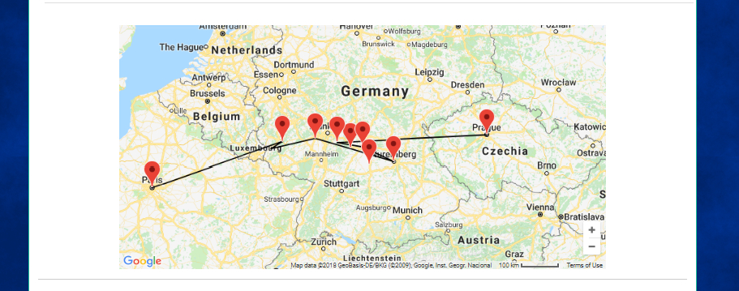

# GMaps Google Maps Shortcode

A simple wordpress plugin to insert Google Maps into posts/pages using the javascript API. Can be used to create markers, lines, and arbitrary shapes.

Before using this plugin you must set GMaps API Key in google in Settings > General. To your [API Key][google-api-key].

# Shortcodes

## gmaps

  The main shortcode of this plugin used to insert a map into a page. All other gmaps shortcodes must be nested inside a gmaps shortcode.

#### Attributes

###### id: Optional

 The id to use for the div map element if not given one will be generated.
 
 Default: None

---

###### lng: Required

 The Longitude of the center point on the map.

 Default: None

---

###### lat: Required

 The Latitude of the center point on the map.

 Default: None

---

###### type: Optional

 The Type of map can be:
   - roadmap
   - satellite
   - terrain
   - hybrid
 
 Default: roadmap

---

###### zoom: Optional

  The Scale to draw the map too

  Default: 6

---

###### disable-default-ui: Optional

 Disable all default Ui Elements

 Default: false

---

###### draggable: Optional

 Whether the map can be Dragged or not

 Default: false

---

###### streeview-control: Optional
 
 Whether or not draw the streetview control

 Default: false

 ---

###### shortcuts: Optional

 Enable Keyboard shortcuts on the generated map

 Default: true

 ---

###### type-control: Optional

 Whether to display the map type control

 Default: true

 ---

###### disable-click-zoom: Optional

 Whether to zoom when clicked

 Default: false

 ---

###### clickable-icons: Optional

 Allow icons to be clickable.

 Default: true

 ---

###### fullscreen-control: Optional

 Enable the fullscreen control.

 Default: false

 ---

###### max-zoom: Optional

 The max scale the map can reach.

 Default: 16

 ---

###### min-zoom: Optional

 The min scale the map can reach.

 Default: 0

 ---
 
###### pan-control: Optional

 Enable/Disable pan control.

 Default: true

 ---

###### rotate-control: Optional

 Enable/Disable the rotate control.

 Default: true

 ---

###### scroll-wheel: Optional

 Enable/ Disable scroll wheel zoom.

 Defeault: true

 ---

---

## gmaps-marker

 Create a Marker object. Must be nested within a gmaps shortcode.

#### Attributes
###### id: Optional

 The id to use for this marker, will be automatically generated if not given. If your planning to open a info-window when clicked must be set.

 Default: marker_XXXXX

 ---


###### title: Optional

 The title to display when the mouse hover's over this marker.

 Default: ''

 ---

###### opacity: Optional

 The opacity of the marker icon.

 Default: 1.0

 ---

###### visible:

 Whether this marker is visible on the map or not.

 Default: true

 ---

###### zindex:

 All markers are displayed on the map by order of their zindex, modify this to place markers on top of eachother.

 Default: 0

 ---

## gmaps-polygon

  Create a Polygon object. Must be nested within a gmaps shortcode.

#### Attributes
###### id: Optional

 The id to use for this element in the map, will be automatically generated if not given.

 Default: polygon_XXXX

 ---

###### stroke-color: Optional

 The outline color to use for this polygon.

 Default: black

 ---

###### stroke-opacity: Optional

 The opacity of the polygon's outline.

 Default: 1.0

 ---

###### stroke-weight: Optional
 
 The line thickness to draw the outline of this polygon.

 Default: 2

 ---

###### clickable: Optional
 
 Enable/Disable mouse and touch events.

 Default: true

 ---

###### zindex: Optional
 
 Order in witch to render this polygon

 Default: 0

 ---

###### editable: Optional

 Enable/disable Whether this polygon can be modified

 Default: false

 ---

###### visible: Optional

 Whether this polygon is initally visible.

 Default: true

 ---

###### draggable: Optional

 Enable/Disable moving polygon with mouse.

 Default: false

 ---

###### geodesic: Optional

 When true, edges of the polygon are interpreted as geodesic and will follow the curvature of the Earth. When false, edges of the polygon are rendered as straight lines in screen space. Note that the shape of a geodesic polygon may appear to change when dragged, as the dimensions are maintained relative to the surface of the earth.

 Default: false

 ---

## gmaps-polyline

  Create a Polygon object. Must be nested within a gmaps shortcode.


#### Attributes
###### id: Optional

 The id to use for this polyline, if not given one will be automatically generated.

 Default: polyline_XXXX


###### stroke-color: Optional

 The outline color to use for this polyline.

 Default: black

 ---

###### stroke-opacity: Optional

 The opacity of the polyline's outline.

 Default: 1.0

 ---

###### stroke-weight: Optional
 
 The line thickness to draw the outline of this polyline.

 Default: 2

 ---

###### clickable: Optional
 
 Enable/Disable mouse and touch events.

 Default: true

 ---

###### zindex: Optional
 
 Order in witch to render this polyline

 Default: 0

 ---

###### editable: Optional

 Enable/disable Whether this polyline can be modified

 Default: false

 ---

###### visible: Optional

 Whether this polyline is initally visible.

 Default: true

 ---

###### draggable: Optional

 Enable/Disable moving polyline with mouse.

 Default: false

 ---

###### geodesic: Optional

 Default: false

 ---

## gmaps-info-window
  Create a Info Window Object. Must be nested within a gmaps shortcode. 

  

#### Attributes

###### marker: Required

  The marker to open this Info Window if clicked.

# Examples

## Basic 
Create a map centered around the Eiffel Tower in Paris, France.

```
[gmaps lat=48.8584 lng=2.2945]
```

## No UI
Create a map with no Ui Features centered around the Eiffel Tower in Paris, France.

```
[gmaps lat=48.8584 lng=2.2945 disable-default-ui=true]
```

## Basic Marker
Create a map with one marker, centered around Angkor Wat, Cambodia.
```
[gmaps lat=13.4125 lng=103.8670]
    [gmaps-marker lat=13.4125 lng=103.8670]
[/gmaps]
```

## Multi Marker
Create a map showing many markers connected by a Polyline.

```
[gmaps lat=13.4125 lng=103.8670]
    [gmaps-marker lat=13.4125 lng=103.8670]
    [gmaps-marker lat=13.0 lng=103]
[/gmaps]
```

# Screenshots


[google-api-key]:https://developers.google.com/maps/documentation/javascript/get-api-key